# RgShows 🎬

RgShows is an open-source HTML-based platform that allows users to watch a variety of content, including TV Shows, Movies, Anime, Live TV and explore Torrents – all for free! Our mission is to provide an enjoyable streaming experience with minimal ads and customizable features.

## Features

✨ **Free Streaming:** Watch your favorite TV shows, movies, and anime without any subscription fees.

🌐 **Wide Variety:** Explore a diverse library of content, including the latest releases and timeless classics.

🚀 **Minimal Ads:** We believe in a streamlined viewing experience, so we keep advertisements to a minimum.

🎨 **Customizations:** Tailor your viewing experience with customizable settings for a personalized touch.

🔥 **Shortcuts:** Use shortcuts for quick navigation. 

## Download links :

1) Official App Link : https://files.catbox.moe/ooxafl.apk 🚀
2) Web View : https://rgshows.vercel.app 🌐
3) RgApps Store Link : https://rgapps.live/ ✨

## Social Handles Link : 

1) Discord : https://discord.gg/bosskingdom-comeback-1090560322760347649 🤝
2) Instagram : https://www.instagram.com/rishabnotfound/ 📷
3) Youtube : https://www.youtube.com/@Rishab07 😎

## Shortcut Keys :

Press `alt`+`1` keys to go to home page quickly.

Press `alt`+`2` keys to go to Movies page quickly.

Press `alt`+`3` keys to go to Shows page quickly.

Press `alt`+`4` keys to go to Anime page quickly.

Press `alt`+`5` keys to go to LiveTV page quickly.

Press `alt`+`6` keys to go to Settings page quickly.

Press `alt`+`T or t` keys to go to Torrent page quickly.

Press `alt`+`M or m` keys to watch a random movie.

Press `alt`+`S or s` keys to watch a random series/show.

Press `alt`+`X or x` keys to close the movies/series/shows player.

Press `alt`+`← (Leftward arrow key)` keys to navigate to the backward page if exist.

Press `alt`+`→ (Rightward arrow key)` keys to navigate to the forward page if exist.

Press `alt`+`Delete` keys to clear all the data.

## Getting Started

To get started with RgShows, simply clone the repository and open the `index.html` file in your preferred web browser. No complex setup or installations required!

```bash
git clone https://github.com/RISHAB-CREATOR/RgShows.git
cd RgShows
```

## Usage : 

1) Fork the repository.
2) Activate the github page.
3) And Enjoy...!

``
Or
``

1) Download the source code from releases.
2) Open the index.html file in your web browser.
3) Browse through the extensive catalog of shows and movies.
4) Enjoy the content for free with minimal interruptions.
5) Customize your viewing experience using the provided settings.

## ScreenShots : 
### How to open movies ?
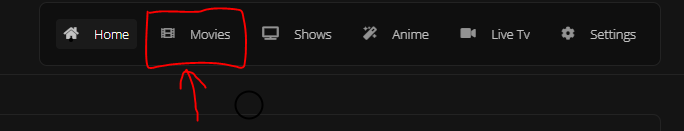

### How play movies from Servers ?
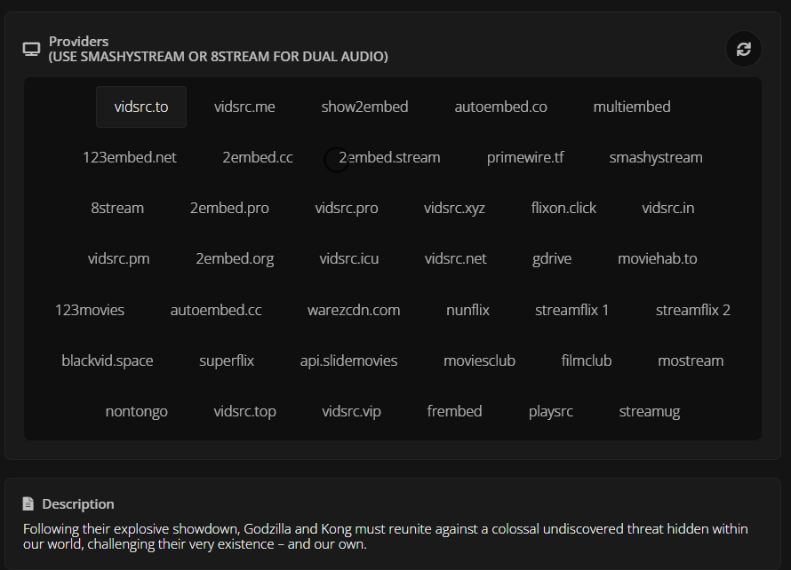

### How to open Shows ?
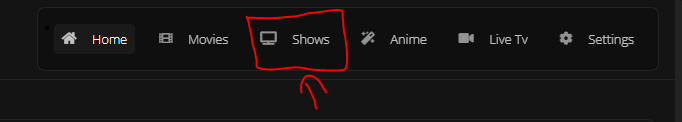

### How to choose episodes ?
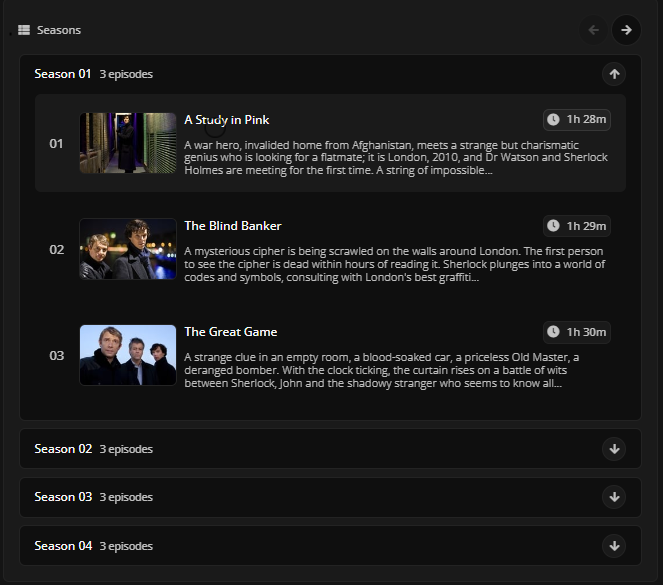

### How to play episodes from different Servers ?
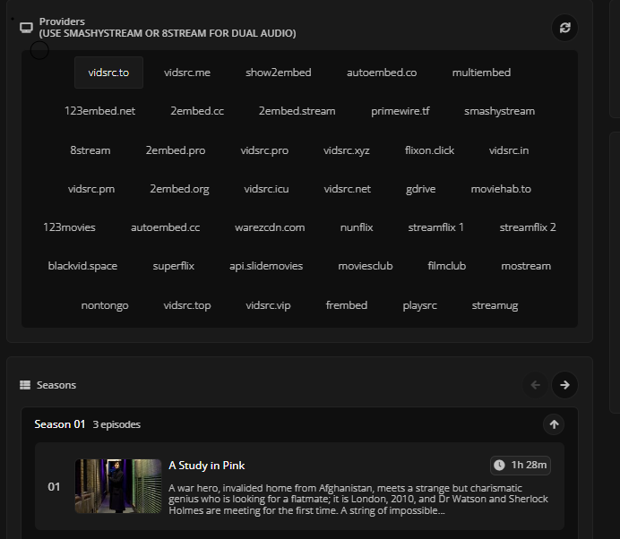

### How to open Anime ?
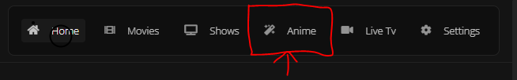

### How to select episodes in Anime?
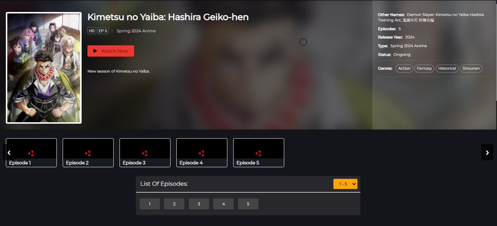

### How to select different Servers or Download Anime?


### How to open LiveTv?
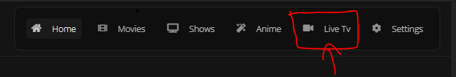

### How to select different channels?
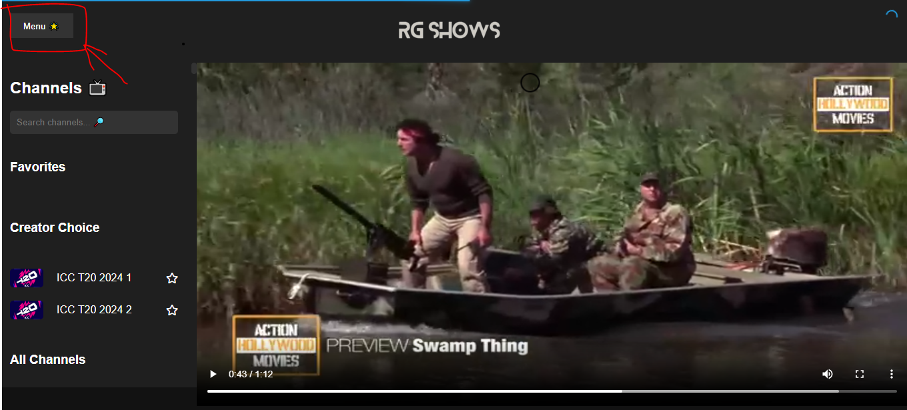

### How to Mark Channel as Favorite?
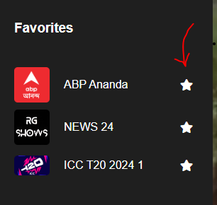

### How to open Settings?
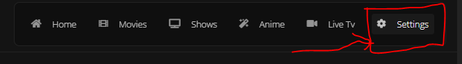

### How to customize RgShows or Clear my data?
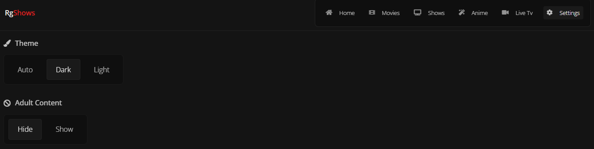
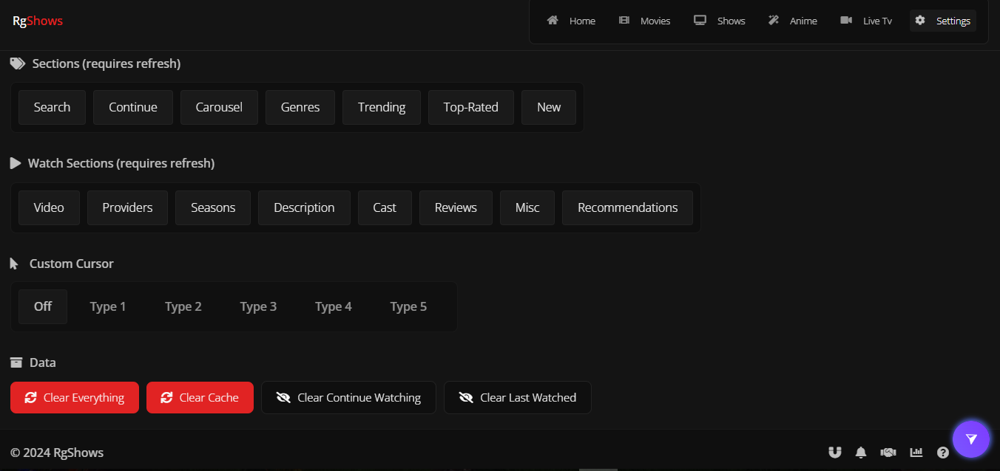

### How to Search?
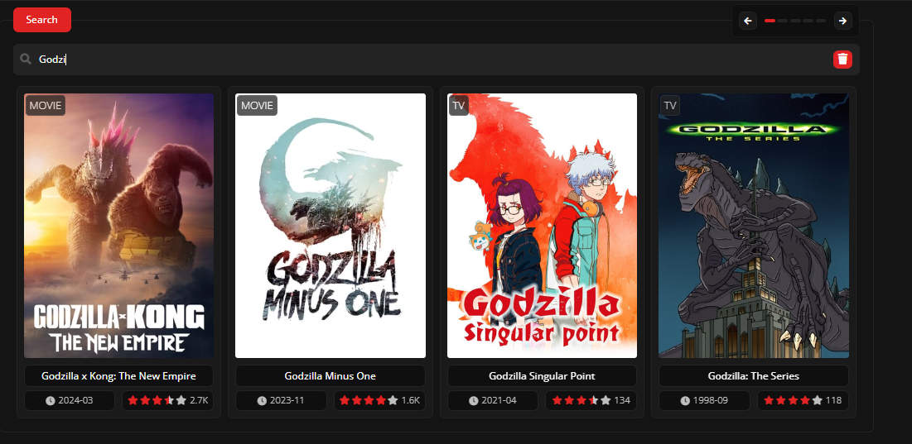

### How to open Torrent?
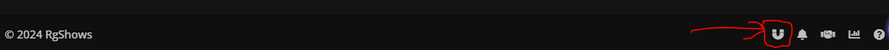

### How to Search or use Torrent Search Engine?
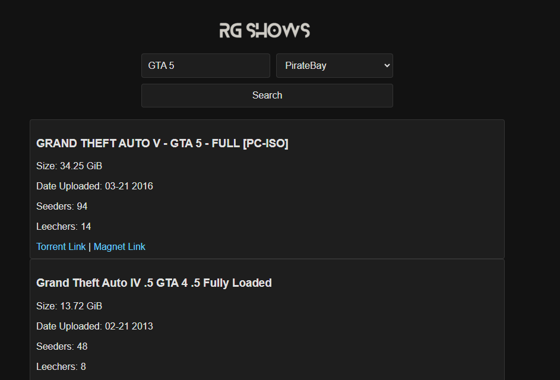

### How to add RgShows PWA?


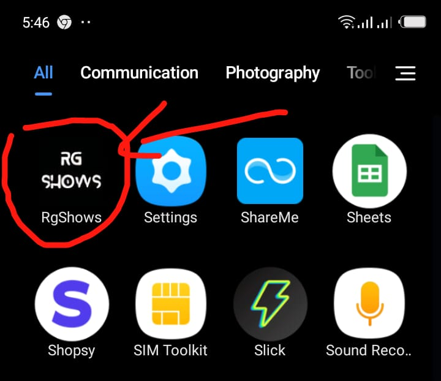

### How to report us any issues?
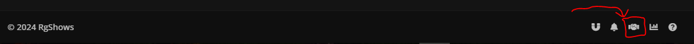
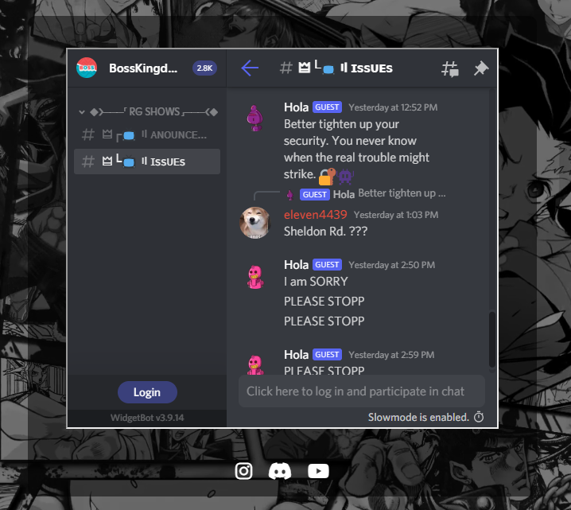

## Contributing
We welcome contributions from the community! Whether it's fixing bugs, adding new features, or improving documentation, every contribution is valuable.

## Open a pull request.
Issues
If you encounter any issues while using RgShows or have suggestions for improvement, please create an issue. We appreciate your feedback!

## License
This project is licensed under the MIT License - see the LICENSE file for details.

## Acknowledgements
Special thanks to contributors who have helped shape RgShows into what it is today.
Happy streaming with RgShows! 🍿🎉
  
